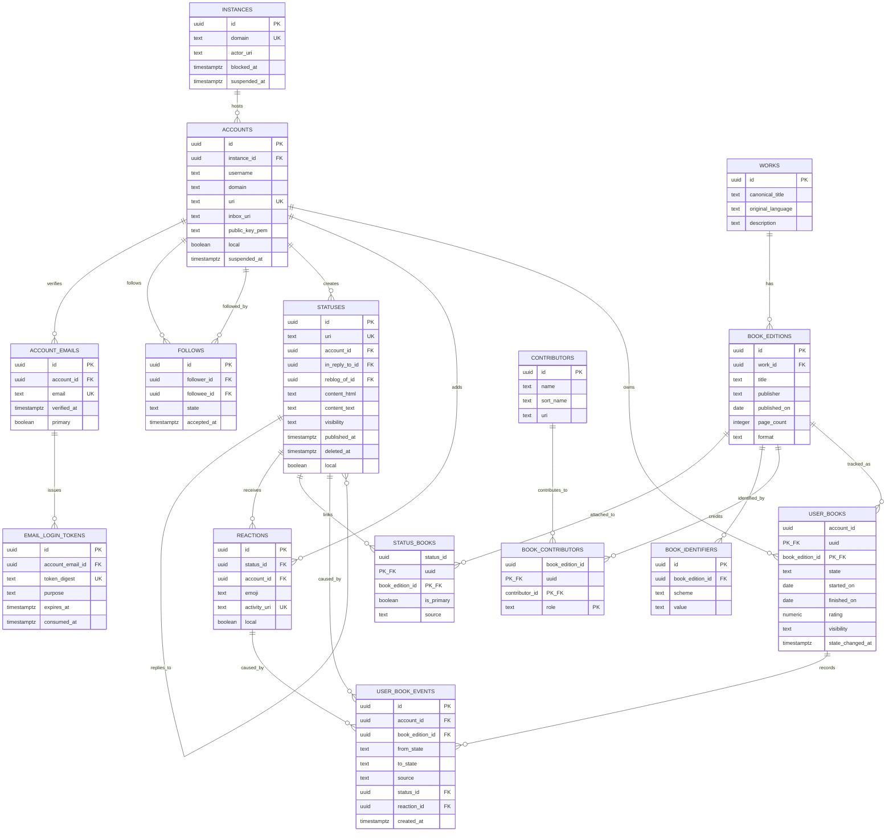
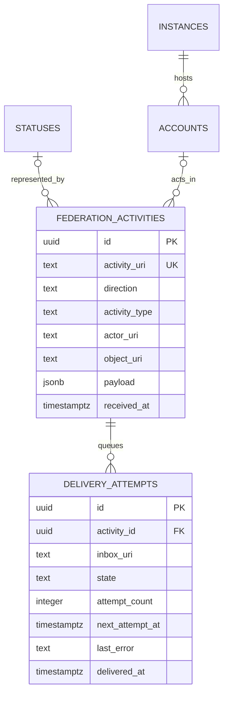

# ER図

## ソーシャル・書誌・読書記録

### 制約

- `accounts`: `(username, domain)` と `uri` は一意
- `account_emails`: `email` は一意。パスワードハッシュは保存しない
- `email_login_tokens`: トークン平文は保存せず、`token_digest` のみを保存する
- `follows`: `(follower_id, followee_id)` は一意
- `reactions`: `(status_id, account_id, emoji)` は一意
- `book_identifiers`: `(scheme, value)` は一意。ISBN-10はISBN-13へ正規化する
- `status_books`: 1投稿に複数冊を紐付けられる。ただし `is_primary = true` は投稿ごとに最大1件
- `user_books`: `(account_id, book_edition_id)` は一意。現在の読書状態を表す

`user_book_events` は状態変更の履歴であり、`user_books` の現在値を更新する際に必ず追加する。
絵文字リアクションによる変更では、`reaction_id` と `status_id` を保存する。

## 連合・配送

`federation_activities` はActivityPubの受信・送信JSONを監査・重複排除のために保存する。
通常の表示・検索はここを直接参照せず、正規化された `accounts`、`statuses`、`reactions` を使う。
`delivery_attempts` は送信を非同期化する永続キューである。

## 公開範囲

通常投稿と本に紐付いた投稿は `statuses` として連合する。本に紐付く投稿では、
`status_books` の主となる本の書誌情報をActivityPubの拡張データとして付与できる。

`user_books` と `user_book_events` は各サーバー内の読書棚・履歴であり、初期リリースでは
連合しない。リアクションした本人の状態だけを更新し、複数冊を紐付けた投稿では
`is_primary` の本だけがその対象となる。
