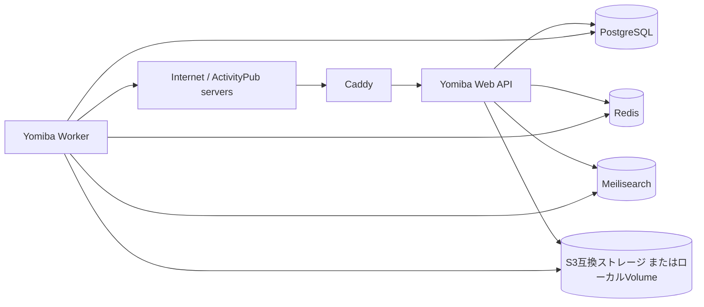

# デプロイ

## 方針

Yomiba は Docker イメージとして配布し、Docker Compose を標準の自己ホスト方法とする。
アプリケーションを単一のGoバイナリとしてビルドし、実行環境の差異をコンテナに閉じ込める。

標準構成は次の6サービスである。



| サービス | 役割 | 外部公開 |
| --- | --- | --- |
| `caddy` | HTTPS終端、リバースプロキシ | 80 / 443のみ |
| `web` | Web UI、Mastodon互換API、ActivityPub endpoint | `caddy` 経由のみ |
| `worker` | 連合配送、Inbox処理、検索更新、メディア処理 | なし |
| `postgres` | 正式な永続データ | なし |
| `redis` | キャッシュ、レート制限、Streaming通知 | なし |
| `meilisearch` | 本・投稿・アカウントの検索インデックス | なし |

PostgreSQL は投稿・本・読書状態などの元データを保存する。Redis と Meilisearch は
PostgreSQLから再作成可能な補助データであり、インターネットに公開してはならない。

## 配布物

リポジトリには次のファイルを用意する。

| ファイル | 用途 |
| --- | --- |
| `Dockerfile` | Goバイナリをマルチステージビルドする |
| `compose.yaml` | ローカル開発・小規模自己ホストの共通構成 |
| `compose.production.yaml` | 本番の再起動ポリシー、リソース制限、Caddyを追加する上書き設定 |
| `.env.example` | 必須環境変数の雛形。秘密情報は含めない |
| `Caddyfile` | HTTPSと`web`へのプロキシ設定 |
| `scripts/backup` | PostgreSQLとアップロード済みメディアのバックアップ |
| `scripts/restore` | 復元手順を自動化する補助スクリプト |

アプリケーションイメージは `ghcr.io/<organization>/yomiba:<version>` として公開する。
本番では `latest` を使わず、リリースタグまたはイメージdigestを指定する。

## 必要条件

- 64bit Linux VM、Docker Engine、Docker Compose plugin
- 固定の公開ドメイン。ActivityPubのActor URLは移設が難しいため、運用開始後に変更しない
- DNSのA/AAAAレコードをVMまたはロードバランサーへ向ける
- 80/TCPと443/TCPをインターネットから受信可能にする
- 初期は 2 vCPU / 4 GB RAM / 30 GB SSD を目安とする。連合先・添付・検索件数が増えれば拡張する
- メール認証に必須のSMTP資格情報

## 環境変数

`.env` はサーバー上だけに置き、Gitへ追加しない。秘密情報には十分な長さのランダム値を使う。

| 変数 | 必須 | 内容 |
| --- | --- | --- |
| `YOMIBA_DOMAIN` | 必須 | `yomiba.example.com`。スキーム・パスを含めない |
| `YOMIBA_BASE_URL` | 必須 | `https://yomiba.example.com`。公開URLの正規値 |
| `YOMIBA_SESSION_KEY` | 必須 | Cookie・セッションを暗号化・署名するランダム鍵 |
| `DATABASE_URL` | 必須 | PostgreSQL接続URL |
| `REDIS_URL` | 必須 | Redis接続URL |
| `MEILI_URL` | 必須 | Meilisearch接続URL |
| `MEILI_MASTER_KEY` | 必須 | Meilisearchの管理鍵 |
| `STORAGE_DRIVER` | 必須 | `local` または `s3` |
| `S3_ENDPOINT` ほか | `s3`時 | endpoint、bucket、region、access key、secret key |
| `SMTP_URL` | 必須 | メール確認・マジックリンク送信用SMTP |
| `LOG_LEVEL` | 任意 | 既定は `info` |

ActivityPubの秘密鍵は、初回起動時に `web` が生成し、`yomiba-data` volume に保存する。
鍵を環境変数に直接書かず、バックアップ対象として扱う。複数の`web`レプリカへ拡張する場合は、
鍵をS3互換ストレージまたはクラウドの秘密情報管理サービスで共有する。

## 小規模セルフホスト

### 初回起動

```sh
git clone https://github.com/<organization>/yomiba.git
cd yomiba
cp .env.example .env
# .env を編集し、YOMIBA_DOMAIN・秘密情報・ストレージを設定する
docker compose -f compose.yaml -f compose.production.yaml pull
docker compose -f compose.yaml -f compose.production.yaml up -d
docker compose -f compose.yaml -f compose.production.yaml ps
```

初回起動では、`web` がDBマイグレーションを実行してからHTTPリスナーを開始する。
`/healthz` はプロセスの稼働確認、`/readyz` はPostgreSQL・Redis・Meilisearchへの接続確認に使う。
公開前に `https://<domain>/.well-known/webfinger` と `https://<domain>/api/v1/instance` を確認する。

### Compose上の重要な設定

```yaml
services:
  web:
    image: ghcr.io/<organization>/yomiba:${YOMIBA_VERSION}
    command: ["web"]
    restart: unless-stopped
    env_file: .env
    depends_on:
      postgres:
        condition: service_healthy
    volumes:
      - yomiba-data:/var/lib/yomiba

  worker:
    image: ghcr.io/<organization>/yomiba:${YOMIBA_VERSION}
    command: ["worker"]
    restart: unless-stopped
    env_file: .env
    volumes:
      - yomiba-data:/var/lib/yomiba

  postgres:
    image: postgres:<supported-major>
    restart: unless-stopped
    volumes:
      - postgres-data:/var/lib/postgresql/data
```

実際の `compose.yaml` では、RedisとMeilisearchにもnamed volumeとhealthcheckを設定する。
`postgres`、`redis`、`meilisearch`、`web` のコンテナポートはホストへ公開せず、
`caddy` の80/443だけを `ports` で公開する。

## Railway

RailwayではDockerfileを使って各サービスを別々に作成する。

| Railway service | Docker command / source | 備考 |
| --- | --- | --- |
| Web | `Dockerfile`、`web` コマンド | Public Domainを割り当てる |
| Worker | 同じDockerfile、`worker` コマンド | Public Domainは不要 |
| PostgreSQL | Railway PostgreSQL | `DATABASE_URL` をWebとWorkerへ渡す |
| Redis | Railway Redis | `REDIS_URL` をWebとWorkerへ渡す |
| Meilisearch | Meilisearchイメージ | Volumeと `MEILI_MASTER_KEY` が必要 |

Railway側でTLSを終端するため、Caddyは不要である。`YOMIBA_BASE_URL` はRailwayの一時ドメインではなく、
最初から独自ドメインを設定する。コンテナに書いたローカルファイルは永続化が保証されないため、
メディアはS3互換ストレージを使い、ActivityPub秘密鍵も永続Volumeまたは秘密情報管理機能へ置く。

## AWS EC2 / Google Compute Engine

1台構成では、UbuntuまたはDebianのVMにDocker EngineとCompose pluginを導入し、
「小規模セルフホスト」のCompose構成を実行する。

| 項目 | AWS EC2 | Google Compute Engine |
| --- | --- | --- |
| VM | EC2 instance | Compute Engine VM |
| ファイアウォール | Security Groupで80/443のみを公開 | VPC firewall ruleで80/443のみを公開 |
| DBの移行先 | RDS for PostgreSQL | Cloud SQL for PostgreSQL |
| オブジェクトストレージ | S3 | Cloud Storage（S3互換gateway経由または対応driver） |
| バックアップの保存先 | S3 | Cloud Storage |

DB、Redis、検索を同一VMから始め、利用者と連合配送量が増えてからマネージドDB・
オブジェクトストレージへ分離する。インスタンスを停止・再作成する場合でも、
`postgres-data`、`meilisearch-data`、`yomiba-data` の永続volumeを失わないよう、
ブロックストレージと定期バックアップを使う。

## バックアップと復元

最低限、毎日次を実行する。

1. `pg_dump` によりPostgreSQLを取得する。
2. `yomiba-data` のActivityPub秘密鍵を暗号化して保存する。
3. `STORAGE_DRIVER=local` の場合はアップロード済みメディアを保存する。
4. バックアップをVMとは別のS3/Cloud Storage等へ転送する。
5. 月に1度は隔離環境へ復元して、ログイン・投稿・検索・Actor公開を確認する。

RedisとMeilisearchはバックアップ必須ではない。復元後にRedisを空にし、
MeilisearchはPostgreSQLから再インデックスする。

```sh
# 概念例: PostgreSQLの論理バックアップ
docker compose exec -T postgres pg_dump -U "$POSTGRES_USER" "$POSTGRES_DB" > yomiba.sql

# 復元は停止した検証環境でのみ行う
docker compose exec -T postgres psql -U "$POSTGRES_USER" "$POSTGRES_DB" < yomiba.sql
```

本番DBへ直接復元しない。必ず新しい検証用DBで復元テストをしてから、復旧手順を判断する。

## 更新とロールバック

1. リリースノートで必要な環境変数・マイグレーション・互換性を確認する。
2. PostgreSQLと秘密鍵、ローカルメディアをバックアップする。
3. `YOMIBA_VERSION` を新しい固定バージョンへ更新する。
4. `docker compose pull` 後に `docker compose up -d` でWebとWorkerを更新する。
5. `/readyz`、投稿、Inbox受信、配送キューを確認する。

DBマイグレーションを含むリリースは、旧バージョンへ単純に戻せない場合がある。
マイグレーションは後方互換な追加を先に行い、破壊的な列・インデックス削除は次のリリースへ
分ける。ロールバックが必要な場合は、アプリケーションだけでなくDBスキーマの互換性を確認する。

## セキュリティと運用

- `DATABASE_URL`、SMTP、S3、Meilisearch、ActivityPub秘密鍵をログへ出力しない。
- DB・Redis・Meilisearchのポートをインターネットへ公開しない。
- CaddyでTLSを自動更新し、`YOMIBA_DOMAIN` 以外のHostヘッダーを拒否する。
- コンテナは非rootユーザーで実行し、読み取り専用ファイルシステムを優先する。鍵・一時ファイル用の書き込み領域だけを明示する。
- WebとWorkerにCPU・メモリ上限を設定し、配送先URLのSSRF対策とHTTPタイムアウトを有効にする。
- 失敗した配送数、ワーカー待ち件数、DB容量、ディスク残量、HTTP 5xx率を監視し、通知する。
- ActivityPub公開URL、Actor URL、秘密鍵を無計画に変更しない。変更は既存の連合関係を壊す可能性がある。
